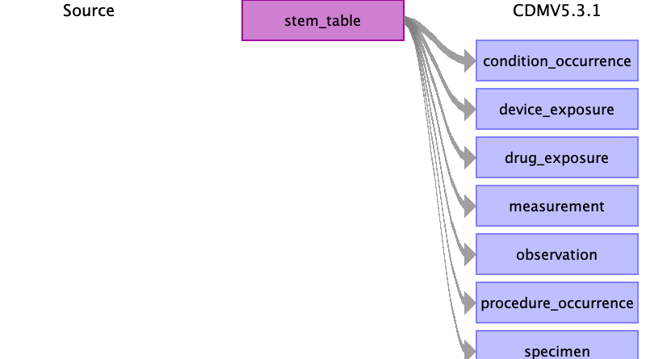

# UK BioBank to OMOP CDM v5.3.1

The UK BioBank data consists of five sections
- Baseline, survey and lab results collected during visits to the assessment centres
- Hospital Episode Statistic, inpatient care
- General Practitioner, outpatient care
- Covid registry
- Death registry

Here we specify the mapping of each of these sections to the respective OMOP tables.

## Health System data

### Care_site
- [From baseline](baseline_to_care_site.md)
- [From covid](covid_to_care_site.md)

## Clinical data

### Person
- [From baseline](baseline_to_person.md)

### Observation_period 
- [From gp_registrations](gp_registrations_to_observation_period.md)

### Death
- [death](death_to_death.md)

### Visit_occurrence
We use a heuristic to 'calculate' a unique 16 digit visit_occurrence_id for each of the sources.
The id is a concatenation of a source digit (1 digit), the `eid` (7 digits) and an index unique within the patient (filled to 8 digits).
What field is used as the index is specific to the source table, see overview below.
Note that the visit_occurence_id has to be a Big Integer to be able to hold 16 digits.

From baseline: `1<eid><instance>`, e.g. 1_9876543_00000001

From covid: `2<eid><date>`, e.g. 2_9876543_20201231

From hesin: `3<eid><spell_index>`, e.g. 3_9876543_00000012

From gp_clinical and gp_prescriptions: `4<eid><date>`, e.g. 4_9876543_20201231

- [From baseline](baseline_to_visit_occurrence.md)
- [From covid](covid_to_visit_occurrence.md)
- [From hesin](hesin_to_visit_occurrence.md)
- [From gp_clinical and gp_prescriptions](gp_clinical_prescriptions_to_visit_occurrence.md)

### Visit_detail
We use a heuristic to 'calculate' a unique 11 digit visit_detail_id.
As the hesin table is the only source for visit details, 
we only need to concatenate the `eid` and an index (the `ins_index`).

From hesin: `<eid><ins_index>`, e.g. 9876543_0084

- [From hesin](hesin_to_visit_detail.md)

### Condition_occurrence
- [From death](death_to_condition_occurrence.md)
- [From hesin_diag](hesin_diag_to_condition_occurrence.md)
- [From cancer_registry](cancer_register_to_condition_occurrence.md)

### Drug_exposure
- [From gp_prescriptions](gp_prescriptions_to_drug_exposure.md)

### Procedure_occurrence
- [From hesin_oper](hesin_oper_to_procedure_occurrence.md)

### Observation
- [From covid](covid_to_observation.md)
- [From gp_clinical](gp_clinical_to_observation.md)

## Stem_table
- [From baseline](baseline_to_stem_table.md)
- [From gp_clinical](gp_clinical_to_stem_table.md)

## Stem_to_clinical_event

The stem table is mapped to the respective OMOP domains based on the domain_id.
The following rules are applied, in this order:

1. If `stem_table.domain_id` given, then read target domain from `stem_table.domain_id`
2. If `stem_table.concept_id` not 0, then read target domain from `concept.domain_id`
3. Else, the target domain is Observation.

- [To condition_occurrence](stem_to_condition_occurrence.md)
- [To drug_exposure](stem_to_drug_exposure.md)
- [To procedure_occurrence](stem_to_procedure_occurrence.md)
- [To device_exposure](stem_to_device_exposure.md)
- [To measurement](stem_to_measurement.md)
- [To specimen](stem_to_specimen.md)
    
## Source table appendix
- [HES, GP and covid appendix](source_appendix.md)
- [baseline appendix](baseline_source_appendix.md)

# Metadta
- [CDM Source](cdm_source.md)