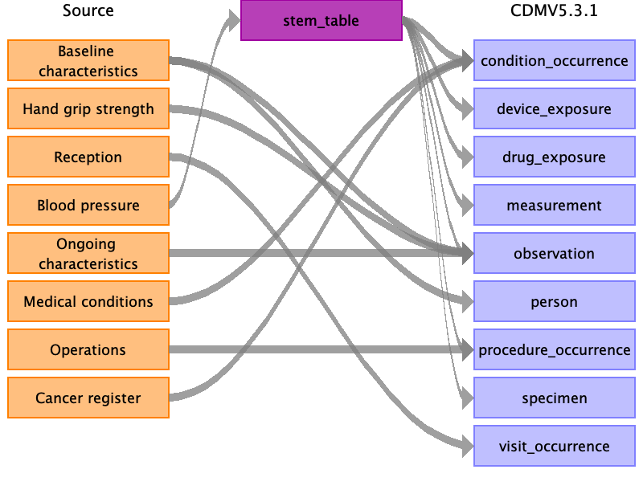

# UK Biobank Survey to OMOP CDM v5.3.1 (WIP)
    

## Health System data
- [Location](location.md) (empty)
- [Care Site](care_site.md) (empty)

## Clinical data
- [Person](person.md)
- [Visit Occurrence](visit_occurrence.md)
- [Condition Occurrence](../cancer_register_to_condition_occurrence.md)
- [Procedure Occurrence](procedure_occurrence.md)
- [Observation](observation.md)
- [Death](death.md)
- [Stem Table](stem_table.md)

## Stem to domains
- [STEM](stem/index.md)

# Notes
- Markdown files were created by Rabbit in a Hat.
- The meaning of the UK Biobank data field id's can be found at the [online data dictionary](https://biobank.ctsu.ox.ac.uk):
    1. Take the id without instance and aray number (e.g. `34-0.0` => `34`) 
    2. Navigate to: `https://biobank.ctsu.ox.ac.uk/crystal/field.cgi?id=<id>`. e.g. https://biobank.ctsu.ox.ac.uk/crystal/field.cgi?id=34 (year of birth)  
