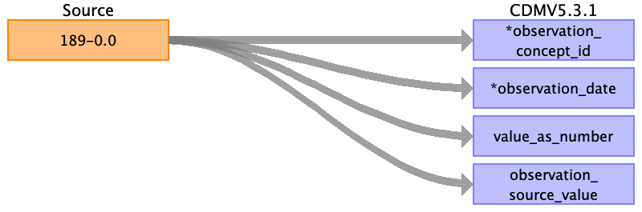
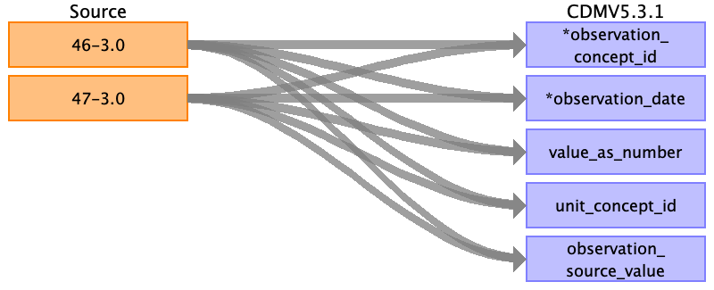
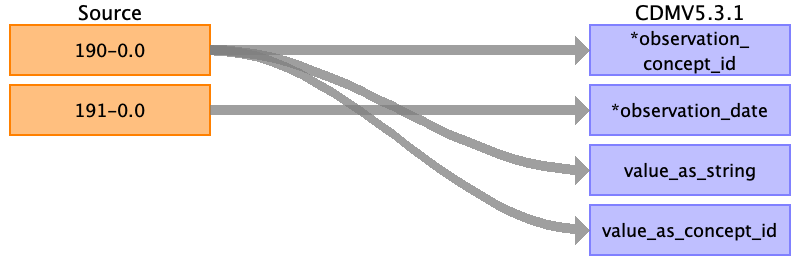

## Table name: observation

### Reading from Baseline characteristics

| Destination Field | Source field | Logic | Comment field |
| --- | --- | --- | --- |
| observation_id |  |  |  |
| person_id |  |  | Use eid (not included) |
| observation_concept_id | 189-0.0 | TBD, custom 2B+ concept? | No concept for Townsend index (UK specific)  |
| observation_date | 189-0.0 | Date of attending assessment center (field 53-0.0) |  |
| observation_datetime |  |  |  |
| observation_type_concept_id |  |  | In between patient reported and clinical study? = population study   Best fit would be from visit types = Health Examination    Current options:  45905771 - Observation Recorded from a Survey  or  581413 - Observation from Measurement |
| value_as_number | 189-0.0 |  |  |
| value_as_string |  |  |  |
| value_as_concept_id |  |  |  |
| qualifier_concept_id |  |  |  |
| unit_concept_id |  |  |  |
| provider_id |  |  |  |
| visit_occurrence_id |  |  | Lookup visit occurrence belonging to this person (eid) and this instance_id. |
| visit_detail_id |  |  |  |
| observation_source_value | 189-0.0 |  |  |
| observation_source_concept_id |  |  |  |
| unit_source_value |  |  |  |
| qualifier_source_value |  |  |  |

### Reading from Hand grip strength

| Destination Field | Source field | Logic | Comment field |
| --- | --- | --- | --- |
| observation_id |  |  |  |
| person_id |  |  | Use eid (not included) |
| observation_concept_id | 46-3.0 47-3.0 | 44805438 - SNOMED observation |  |
| observation_date | 46-3.0 47-3.0 | Use corresponding date of attending assessment center.  If instance 0: 53-0.0  If instance 1: 53-1.0  If instance 2: 53-2.0  If instance 3: 53-3.0  |  |
| observation_datetime |  |  |  |
| observation_type_concept_id |  |  | In between patient reported and clinical study? = population study   Best fit would be from visit types = Health Examination    Current options:  45905771 - Observation Recorded from a Survey  or  581413 - Observation from Measurement |
| value_as_number | 46-3.0 47-3.0 | kg (UCUM concept) |  |
| value_as_string |  |  |  |
| value_as_concept_id |  |  |  |
| qualifier_concept_id |  |  |  |
| unit_concept_id | 46-3.0 47-3.0 | kg (UCUM concept)  |  |
| provider_id |  |  |  |
| visit_occurrence_id |  |  | Lookup visit occurrence belonging to this person (eid) and this instance_id. |
| visit_detail_id |  |  |  |
| observation_source_value | 46-3.0 47-3.0 |  |  |
| observation_source_concept_id |  |  |  |
| unit_source_value |  |  |  |
| qualifier_source_value |  |  |  |

### Reading from Ongoing characteristics

| Destination Field | Source field | Logic | Comment field |
| --- | --- | --- | --- |
| observation_id |  |  |  |
| person_id |  |  | Use eid (not included) |
| observation_concept_id | 190-0.0 | 'Reason Lost to follow-up' (45956528, CEIL, non-standard) |  |
| observation_date | 191-0.0 |  |  |
| observation_datetime |  |  |  |
| observation_type_concept_id |  |  | In between patient reported and clinical study? = population study   Best fit would be from visit types = Health Examination    Current options:  45905771 - Observation Recorded from a Survey  or  581413 - Observation from Measurement |
| value_as_number |  |  |  |
| value_as_string | 190-0.0 | Description of the value |  |
| value_as_concept_id | 190-0.0 | Map values to concept_id |  |
| qualifier_concept_id |  |  |  |
| unit_concept_id |  |  |  |
| provider_id |  |  |  |
| visit_occurrence_id |  |  | Lookup visit occurrence belonging to this person (eid) and this instance_id. |
| visit_detail_id |  |  |  |
| observation_source_value |  |  |  |
| observation_source_concept_id |  |  |  |
| unit_source_value |  |  |  |
| qualifier_source_value |  |  |  |

