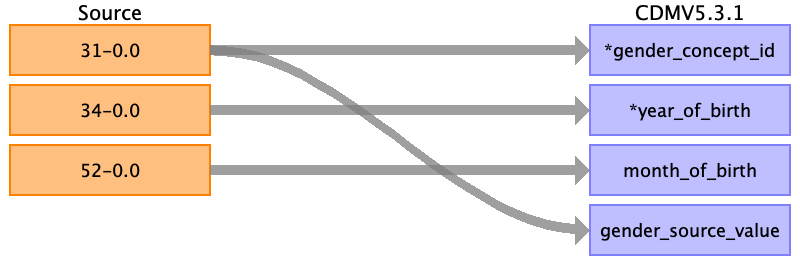

## Table name: person

### Reading from Baseline characteristics

| Destination Field | Source field | Logic | Comment field |
| --- | --- | --- | --- |
| person_id | eid |  |  |
| gender_concept_id | 31-0.0 | 0 : 8532 # female 1 : 8507  # male |  |
| year_of_birth | 34-0.0 | Convert to int |  |
| month_of_birth | 52-0.0 | Convert to int |  |
| day_of_birth |  |  |  |
| birth_datetime |  |  |  |
| race_concept_id | 21000-0.0 | 1: 8527 #white 2: 4212311 #mixed racial group SNOMED 3: 8515 #asian 4: 38003598 #black 5: 38003579 #chinese | Only top level mapped. Because it is UK data, >90% is 'white british' |
| ethnicity_concept_id |  | 0 |  |
| location_id | 54-0.0 | Populate location table with each of the ~23 cities of the assessment centers | Another possibility is to map this to a care_site |
| provider_id |  |  |  |
| care_site_id |  |  |  |
| person_source_value | eid |  |  |
| gender_source_value | 31-0.0 |  |  |
| gender_source_concept_id |  |  |  |
| race_source_value | 21000-0.0 |  |  |
| race_source_concept_id |  |  |  |
| ethnicity_source_value |  |  |  |
| ethnicity_source_concept_id |  |  |  |

