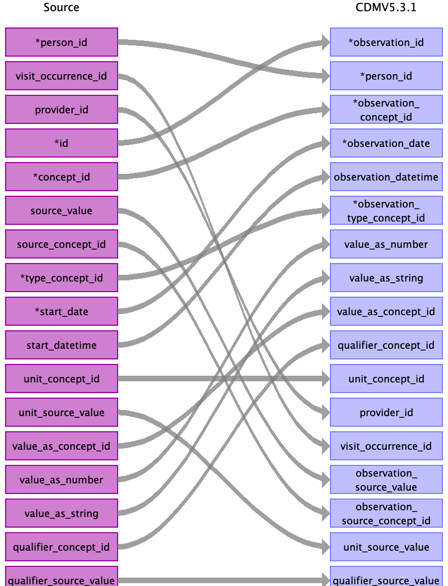

## Table name: observation

### Reading from stem_table

| Destination Field | Source field | Logic | Comment field |
| --- | --- | --- | --- |
| observation_id | id |  |  |
| person_id | person_id |  | Use eid (not included) |
| observation_concept_id | concept_id |  |  |
| observation_date | start_date |  |  |
| observation_datetime | start_datetime |  |  |
| observation_type_concept_id | type_concept_id |  | In between patient reported and clinical study? = population study   Best fit would be from visit types = Health Examination    Current options:  45905771 - Observation Recorded from a Survey  or  581413 - Observation from Measurement |
| value_as_number | value_as_number |  |  |
| value_as_string | value_as_string |  |  |
| value_as_concept_id | value_as_concept_id |  |  |
| qualifier_concept_id | qualifier_concept_id |  |  |
| unit_concept_id | unit_concept_id |  |  |
| provider_id | provider_id |  |  |
| visit_occurrence_id | visit_occurrence_id |  | Lookup visit occurrence belonging to this person (eid) and this instance_id. |
| visit_detail_id |  |  |  |
| observation_source_value | source_value |  |  |
| observation_source_concept_id | source_concept_id |  |  |
| unit_source_value | unit_source_value |  |  |
| qualifier_source_value | qualifier_source_value |  |  |

