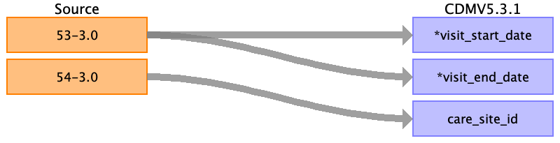

## Table name: visit_occurrence

### Reading from Reception

| Destination Field | Source field | Logic | Comment field |
| --- | --- | --- | --- |
| visit_occurrence_id |  |  |  |
| person_id |  |  |  |
| visit_concept_id |  |  | From Reception:   See other mapping document. |
| visit_start_date | 53-3.0 | For each instance of this variable, create a visit occurrence. |  |
| visit_start_datetime |  |  |  |
| visit_end_date | 53-3.0 |  |  |
| visit_end_datetime |  |  |  |
| visit_type_concept_id |  |  |  |
| provider_id |  |  |  |
| care_site_id | 54-3.0 |  |  |
| visit_source_value |  |  |  |
| visit_source_concept_id |  |  |  |
| admitting_source_concept_id |  |  |  |
| admitting_source_value |  |  |  |
| discharge_to_concept_id |  |  |  |
| discharge_to_source_value |  |  |  |
| preceding_visit_occurrence_id |  |  |  |

