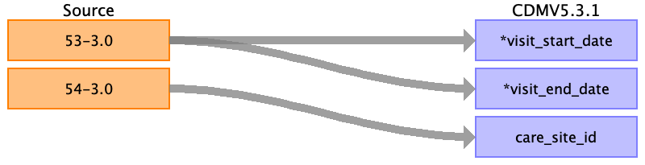

## Table name: care_site

### Reading from baseline

For all unique assessment centres (field 54).
See data dictionary: https://biobank.ctsu.ox.ac.uk/crystal/field.cgi?id=54

| Destination Field | Source field | Logic | Comment field |
| --- | --- | --- | --- |
| care_site_id | Coding |  | According to Data-Coding 10 |
| care_site_name | Meaning |  | According to Data-Coding 10 |
| place_of_service_concept_id |  |  |  |
| location_id |  |  |  |
| care_site_source_value | Coding |  |  |
| place_of_service_source_value |  |  |  |

