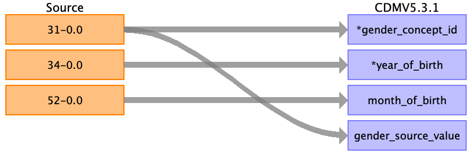

## Table name: person

### Reading from Baseline

The person table contains the main demographics as recorded during the first assessment center visit (instance 0). 
The demographics recorded are gender, year of birth, month of birth, race and assessment center.

If field 34, year of birth, is empty then the person is skipped.

| Destination Field | Source field | Logic | Comment field |
| --- | --- | --- | --- |
| person_id | eid |  |  |
| gender_concept_id | 31-0.0 | 0 : 8532 # female 1 : 8507  # male |  |
| year_of_birth | 34-0.0 | Convert to int |  |
| month_of_birth | 52-0.0 | Convert to int, NULL if source field empty |  |
| day_of_birth |  |  |  |
| birth_datetime |  |  |  |
| race_concept_id | 21000-0.0 | 1: 8527 #white 2: 4212311 #mixed racial group SNOMED 3: 8515 #asian 4: 38003598 #black 5: 38003579 #chinese | Only top level mapped. Because it is UK data, >90% is 'white british' |
| ethnicity_concept_id |  | 0 |  |
| location_id | | | |
| provider_id |  |  |  |
| care_site_id | 54-0.0 |  | Care site table is populated with all unique assessment centres, using same id. | 
| person_source_value | eid |  |  |
| gender_source_value | 31-0.0 |  |  |
| gender_source_concept_id |  |  |  |
| race_source_value | 21000-0.0 |  |  |
| race_source_concept_id |  |  |  |
| ethnicity_source_value |  |  |  |
| ethnicity_source_concept_id |  |  |  |
