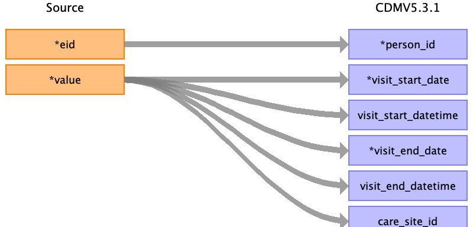

## Table name: visit_occurrence

### Reading from baseline

One person can have up to 4 visits (labeled 0-3).
Follow-up online or to assessment center.

| Destination Field | Source field | Logic | Comment field |
| --- | --- | --- | --- |
| visit_occurrence_id | eid instance | Concatenate 1, eid and instance |  |
| person_id | eid |  |  |
| visit_concept_id |  |  | 44818519 - Clinical Study visit |
| visit_start_date | 53-<instance>.0 | Field 53-0.0 -> date of initial assessment visit  Field 53-1.0 -> date of repeat assessment visit  Field 53-2.0 -> date of first imaging visit  Field 53-3.0 -> date of second imaging visit | Capture different record for each instance  |
| visit_start_datetime | 53-<instance>.0 | Same as mapping to visit_start_date |  |
| visit_end_date | 53-<instance>.0 | Same as mapping to visit_start_date |  |
| visit_end_datetime | 53-<instance>.0 | Same as mapping to visit_start_date |  |
| visit_type_concept_id |  | 32883 - Survey |  |
| provider_id |  |  |  |
| care_site_id | 54-<instance>.0 | If field 54-<instance>.0 is NaN set to 0 |  |
| visit_source_value |  |  |  |
| visit_source_concept_id |  |  |  |
| admitting_source_concept_id |  |  |  |
| admitting_source_value |  |  |  |
| discharge_to_concept_id |  |  |  |
| discharge_to_source_value |  |  |  |
| preceding_visit_occurrence_id |  |  |  |
| record_source_value |  | 'baseline-<instance> |  |  |
|data_source |  | 'baseline' |  |  |