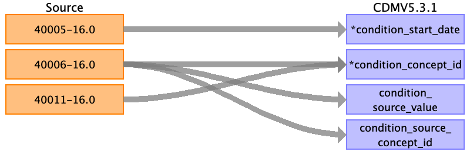

## Table name: condition_occurrence

### Reading from Cancer register

The Cancer registry is acquired from national registries.

- The first step is to combine histology (40011), behaviour (40012) and topography (40006) to an ICDO3 code.
If all three codes are given, they are combined to `histology/behaviour-topography` (e.g. 8050/3-C80.9).
If a codes is absent, they are replaced by a default or the record is skipped (Table 1).

_Table 1. h = 4 digit Histology, b = 1 digit Behaviour, t = ICD10 Topography, t9 = ICD9 Topography. 
1 = code given, 0 = code absent._

| h | b | t | ICDOO3 code |
| --- | --- | --- | --- |
|1|1|1| h/b-t |
|1|1|0| h/b-NULL |
|1|0|1| h/1-t |
|1|0|0| h/1-NULL |
|0|1|1| NULL-t |
|0|0|1| NULL-t |
|0|1|0| not captured |
|0|0|0| not captured |

- Then lookup the concept_id of the ICDO3 code.
- If the code is not present in the ICDO3 vocabulary look if the topology code exists. 
There are two fields in baseline for topology. Field 40011, used above, consisting of ICD10 codes and field 40013 filled with ICD9 codes (there is no overlap between the two).
First look if the topography code in the ICD10 vocabulary exists. If not try the ICD9 code.

The cancer registry fields can be repeated up to 16 times for a person.
Each set of fields has an incremental instance id. 
We create a record for every instance for which the topography is given or both the histology and behaviour are provided (As given in table 1, this means skipping 010, 100, 000).
Keep the same instance to all the fields mapped to one record.

| Destination Field | Source field | Logic | Comment |
| --- | --- | --- | --- |
| condition_occurrence_id |  | Auto-increment |  |
| person_id | eid |  |  |
| condition_concept_id | 40011-{instance}.0 40012-{instance}.0 40006-{instance}.0 | Combine fields as described in table above to construct an ICDO3 code, for which the standard concept is looked up in the OMOP vocabulary. |  |
| condition_start_date | 40005-{instance}.0 |  |  |
| condition_start_datetime | 40005-{instance}.0 | as datetime |  |
| condition_end_date |  |  |  |
| condition_end_datetime |  |  |  |
| condition_type_concept_id |  |  | 32879 - Registry |
| stop_reason |  |  |  |
| provider_id |  |  |  |
| visit_occurrence_id |  |  |  |
| visit_detail_id |  |  |  |
| condition_source_value | 40011-{instance}.0 40012-{instance}.0 40006-{instance}.0 | ICDO3 code as constructed above. |  |
| condition_source_concept_id | 40011-{instance}.0 40012-{instance}.0 40006-{instance}.0 | Information is retrieved in the CodeMapper class (in the same object as the code for condition_concept_id). |  |
| condition_status_source_value |  |  |  |
| condition_status_concept_id |  |  |  |
| data_source |  | 'baseline' |  |

