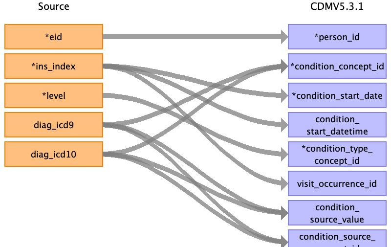
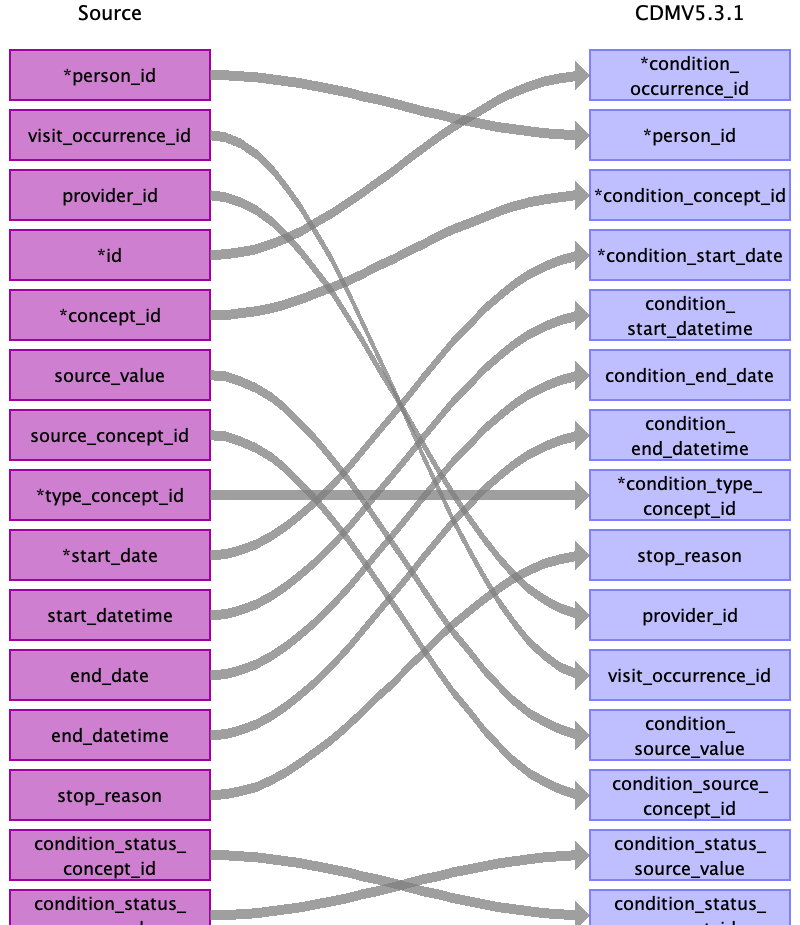

## Table name: condition_occurrence

### Reading from hesin_diag

Join hesin using ins_index

| Destination Field | Source field | Logic | Comment field |
| --- | --- | --- | --- |
| condition_occurrence_id |  |  | Auto-increment |
| person_id | eid |  |  |
| condition_concept_id | diag_icd10 diag_icd9 | Map to OMOP standard concept Map to OMOP standard concept |  |
| condition_start_date | ins_index | Join hesin on ins_index to get admidate. | hesin.admidate  |
| condition_start_datetime | ins_index | Join hesin on ins_index to get admidate. | hesin.admidate  |
| condition_end_date |  |  |  |
| condition_end_datetime |  |  |  |
| condition_type_concept_id | level | 1 - 44786627 primary condition  2 - 44786629 secondary condition  3 - 44786629 |  |
| stop_reason |  |  |  |
| provider_id |  |  |  |
| visit_occurrence_id | ins_index | Lookup visit_occurrence_id by ins_index |  |
| visit_detail_id |  |  |  |
| condition_source_value | diag_icd9 diag_icd10 |  |  |
| condition_source_concept_id | diag_icd9 diag_icd10 |  |  |
| condition_status_source_value |  |  |  |
| condition_status_concept_id |  |  |  |

### Reading from stem_table

| Destination Field | Source field | Logic | Comment field |
| --- | --- | --- | --- |
| condition_occurrence_id | id |  | Auto-increment |
| person_id | person_id |  |  |
| condition_concept_id | concept_id |  |  |
| condition_start_date | start_date |  |  |
| condition_start_datetime | start_datetime |  |  |
| condition_end_date | end_date |  |  |
| condition_end_datetime | end_datetime |  |  |
| condition_type_concept_id | type_concept_id |  |  |
| stop_reason | stop_reason |  |  |
| provider_id | provider_id |  |  |
| visit_occurrence_id | visit_occurrence_id |  |  |
| visit_detail_id |  |  |  |
| condition_source_value | source_value |  |  |
| condition_source_concept_id | source_concept_id |  |  |
| condition_status_source_value | condition_status_source_value |  |  |
| condition_status_concept_id | condition_status_concept_id |  |  |

