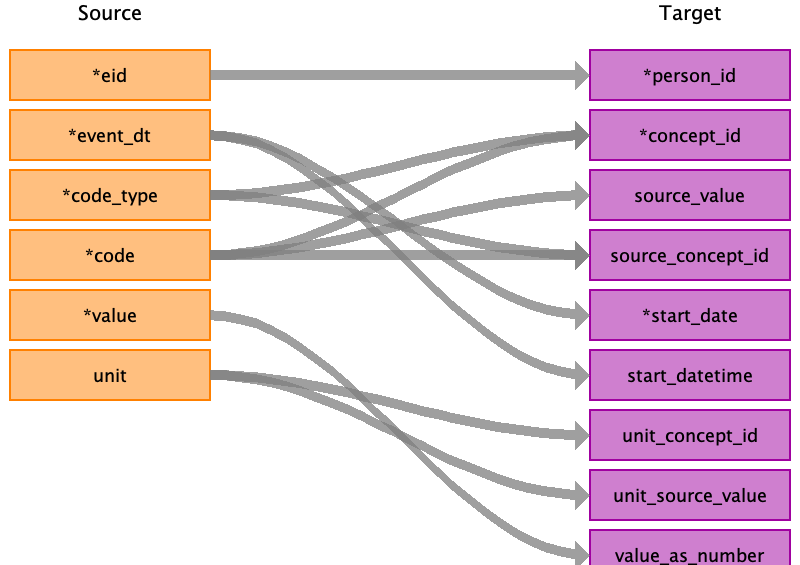

## Table name: stem_table

### Reading from 0_covid19_emis_gp_clinical.txt.gz.pure

Ignore rows were "value" = -9000004, -9000003, -9000002, -9000001

| Destination Field | Source field | Logic | Comment field |
| --- | --- | --- | --- |
| domain_id |  |  | All records from covid19_gp_clinical will be inserted in the measurement table. |
| person_id | eid |  |  |
| visit_occurrence_id |  |  |  |
| provider_id |  |  |  |
| id |  |  | Not used. |
| concept_id | code_type code | Combine the "code_type" with the "code" to use the correct lookup. If "code_type" = "2" use SNOMED lookup. If "code_type' = "3" use Local EMIS lookup. https://biobank.ndph.ox.ac.uk/showcase/coding.cgi?id=3175  |  |
| source_value | code |  |  |
| source_concept_id | code_type code |  |  |
| type_concept_id |  |  | 32817: EHR |
| start_date | event_dt |  |  |
| start_datetime | event_dt |  |  |
| end_date |  |  |  |
| end_datetime |  |  |  |
| verbatim_end_date |  |  |  |
| days_supply |  |  |  |
| dose_unit_source_value |  |  |  |
| lot_number |  |  |  |
| modifier_concept_id |  |  |  |
| modifier_source_value |  |  |  |
| operator_concept_id |  |  |  |
| modifier_source_value |  |  |  |
| quantity |  |  |  |
| range_high |  |  |  |
| range_low |  |  |  |
| refills |  |  |  |
| route_concept_id |  |  |  |
| route_source_value |  |  |  |
| sig |  |  |  |
| stop_reason |  |  |  |
| unique_device_id |  |  |  |
| unit_concept_id | unit |  |  |
| unit_source_value | unit |  |  |
| value_as_concept_id |  |  |  |
| value_as_number | value | If "value" = -9999999 or -9000099 leave "value_as_number" empty.  If "values" = -9000004, -9000003, -9000002, -9000001 ignore the row. https://biobank.ndph.ox.ac.uk/showcase/coding.cgi?id=2360 |  |
| value_as_string |  |  |  |
| value_source_value |  |  |  |
| anatomic_site_concept_id |  |  |  |
| disease_status_concept_id |  |  |  |
| specimen_source_id |  |  |  |
| anatomic_site_source_value |  |  |  |
| disease_status_source_value |  |  |  |
| condition_status_concept_id |  |  |  |
| condition_status_source_value |  |  |  |
| qualifier_concept_id |  |  |  |
| qualifier_source_value |  |  |  |