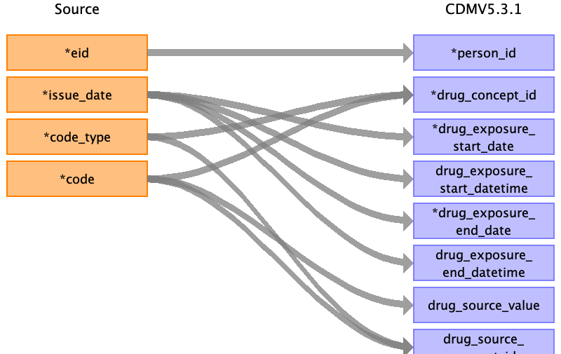

## Table name: drug_exposure

### Reading from 2_covid19_emis_gp_scripts.txt.gz.pure

| Destination Field | Source field | Logic | Comment field |
| --- | --- | --- | --- |
| drug_exposure_id |  |  | Auto-increment |
| person_id | eid |  |  |
| drug_concept_id | code code_type | If code_type 3: use local EMIS lookup  If code_type 6: use dm+d lookup (majority of codes) |  |
| drug_exposure_start_date | issue_date |  |  |
| drug_exposure_start_datetime | issue_date |  |  |
| drug_exposure_end_date | issue_date | start_date+29 days |  |
| drug_exposure_end_datetime | issue_date | start_date+29days |  |
| verbatim_end_date |  |  |  |
| drug_type_concept_id |  |  | 32838 - ‘EHR prescription’ |
| stop_reason |  |  |  |
| refills |  |  |  |
| quantity |  |  |  |
| days_supply |  |  |  |
| sig |  |  |  |
| route_concept_id |  |  |  |
| lot_number |  |  |  |
| provider_id |  |  |  |
| visit_occurrence_id |  |  |  |
| visit_detail_id |  |  |  |
| drug_source_value | code |  |  |
| drug_source_concept_id | code code_type |  |  |
| route_source_value |  |  |  |
| dose_unit_source_value |  |  |  |