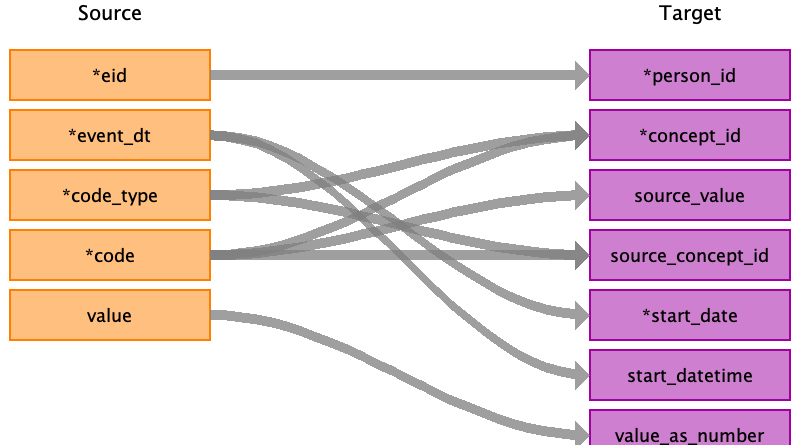

## Table name: stem_table

### Reading from 3_covid19_tpp_gp_clinical.txt.gz.pure

Rows are skipped if:
 - `code` is empty or '-1'
 - `date` is empty or in the year 2037

| Destination Field | Source field | Logic | Comment field |
| --- | --- | --- | --- |
| domain_id |  |  'Measurement' if the record has a value_as_number (which is not 0) or a value_as_concept_id. | As values can only be stored in the measurement (and observation) table, we enforce the domain if a value is given from the source. In other cases, the domain_id of the target `concept_id` will be used to determine the target table as per OMOP conventions. |
| person_id | eid |  |  |
| visit_occurrence_id | eid event_dt | Create a new visit id string with the form: 'covid prefix'(5000)+'eid'+'event_dt' |  |
| provider_id |  |  |  |
| id |  |  | Not used. |
| concept_id | code_type code | Combine the "code_type" with the "code" to use the correct lookup. If "code_type" = "0" use CTV3 lookup. If "code_type" = "1" use Local TPP lookup. If "code_type" = "-1" OR "-2", discard that record. https://biobank.ndph.ox.ac.uk/showcase/coding.cgi?id=3175  |  |
| source_value | code |  |  |
| source_concept_id | code_type code | ATHENA codes are not available for these CVT3 nor local TPP codes. All values are set to 0, as in gp_clinical_to_stem transformation. |  |
| type_concept_id |  |  | 32817: EHR |
| start_date | event_dt | Fill with event date. If missing, discard the row. If 1902-02-02 or 1903-03-3, set date to yob-07-01 (field 34 in baseline)|  |
| start_datetime | event_dt |  |  |
| end_date |  |  |  |
| end_datetime |  |  |  |
| verbatim_end_date |  |  |  |
| days_supply |  |  |  |
| dose_unit_source_value |  |  |  |
| lot_number |  |  |  |
| modifier_concept_id |  |  |  |
| modifier_source_value |  |  |  |
| operator_concept_id |  |  |  |
| modifier_source_value |  |  |  |
| quantity |  |  |  |
| range_high |  |  |  |
| range_low |  |  |  |
| refills |  |  |  |
| route_concept_id |  |  |  |
| route_source_value |  |  |  |
| sig |  |  |  |
| stop_reason |  |  |  |
| unique_device_id |  |  |  |
| unit_concept_id |  |  |  |
| unit_source_value |  |  |  |
| value_as_concept_id |  |  |  |
| value_as_number | value | If not a number, it is 'None'. |  |
| value_as_string |  |  |  |
| value_source_value |  |  |  |
| anatomic_site_concept_id |  |  |  |
| disease_status_concept_id |  |  |  |
| specimen_source_id |  |  |  |
| anatomic_site_source_value |  |  |  |
| disease_status_source_value |  |  |  |
| condition_status_concept_id |  |  |  |
| condition_status_source_value |  |  |  |
| qualifier_concept_id |  |  |  |
| qualifier_source_value |  |  |  |
