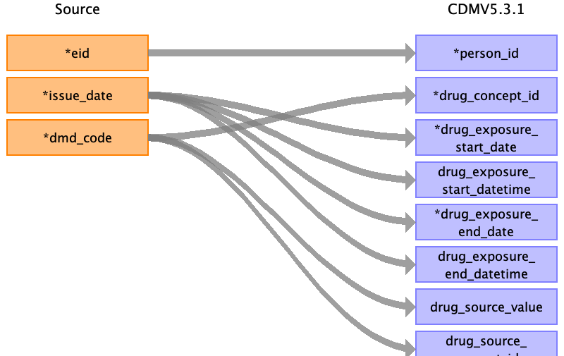

## Table name: drug_exposure

### Reading from 1_covid19_tpp_gp_scripts.txt.gz.pure

| Destination Field | Source field | Logic | Comment field |
| --- | --- | --- | --- |
| drug_exposure_id |  |  | Auto-increment |
| person_id | eid |  |  |
| drug_concept_id | dmd_code | Look up standard concept via "maps to" relationship. | code -1 (no dm+d code) is skipped  |
| drug_exposure_start_date | issue_date |  |  |
| drug_exposure_start_datetime | issue_date |  |  |
| drug_exposure_end_date | issue_date | use the same as the start date |  |
| drug_exposure_end_datetime | issue_date |  |  |
| verbatim_end_date |  |  |  |
| drug_type_concept_id |  |  | 32838 - ‘EHR prescription’ |
| stop_reason |  |  |  |
| refills |  |  |  |
| quantity |  |  |  |
| days_supply |  |  |  |
| sig |  |  |  |
| route_concept_id |  |  |  |
| lot_number |  |  |  |
| provider_id |  |  |  |
| visit_occurrence_id |  |  | visit_id from 'eid' & 'date' |
| visit_detail_id |  |  |  |
| drug_source_value | dmd_code |  |  |
| drug_source_concept_id | dmd_code | Look up source concept via "maps to" relationship. |  |
| route_source_value |  |  |  |
| dose_unit_source_value |  |  |  |
| data_source |  |  | covid19 gp_tpp |