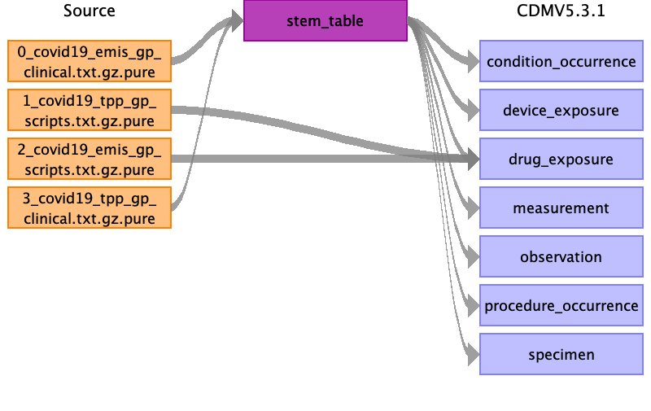

# Source Data Mapping Approach to CDMV5.3.1

## Contents

### Stem table
- [emis_gp_clinical](covid19_emis_gp_clinical_to_stem.md)
- [tpp_gp_clinical](covid19_tpp_gp_clinical_to_stem.md)

### Drug Exposure
- [emis_gp_scripts](covid19_emis_gp_scripts_to_drug_exposure.md)
- [tpp_gp_scripts](covid19_tpp_gp_scripts_to_drug_exposure.md)

### Source table Appendix
- [covid19_tables](covid19_source_appendix.md)

