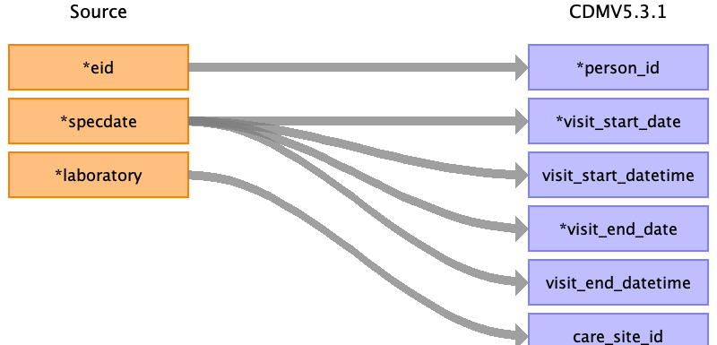
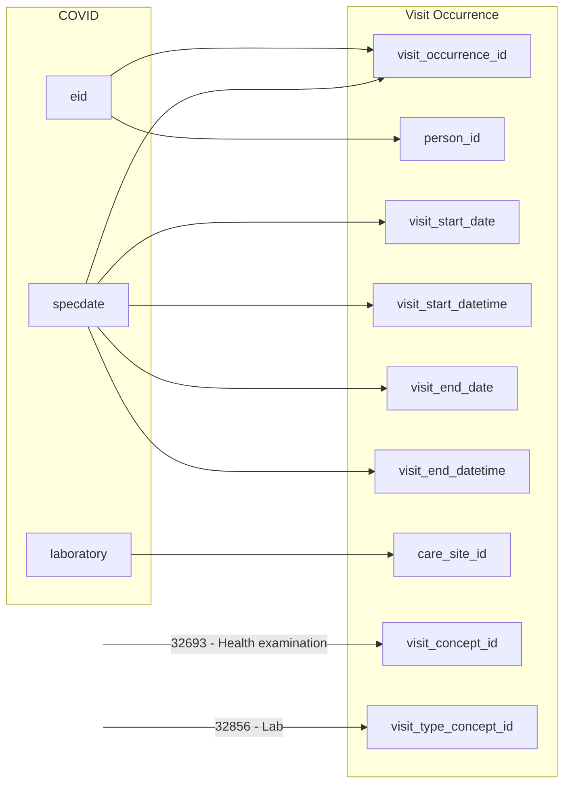

## Table name: visit_occurrence

### Reading from covid

<!--  -->

Take all rows with unique eid and specdate. If the laboratory field is different, the first is taken at random.

| Destination Field | Source field | Logic | Comment field |
| --- | --- | --- | --- |
| visit_occurrence_id | eid specdate | Concatenate '2', eid and specdate in YYYYMMDD format|  |
| person_id | eid |  |  |
| visit_concept_id |  |  | 32693 - Health examination |
| visit_start_date | specdate |  |  |
| visit_start_datetime | specdate |  |  |
| visit_end_date | specdate |  |  |
| visit_end_datetime | specdate |  |  |
| visit_type_concept_id |  |  | 32856 - Lab |
| provider_id |  |  |  |
| care_site_id | laboratory |  |  |
| visit_source_value |  |  |  |
| visit_source_concept_id |  |  |  |
| admitting_source_concept_id |  |  |  |
| admitting_source_value |  |  |  |
| discharge_to_concept_id |  |  |  |
| discharge_to_source_value |  |  |  |
| preceding_visit_occurrence_id |  |  |  |

