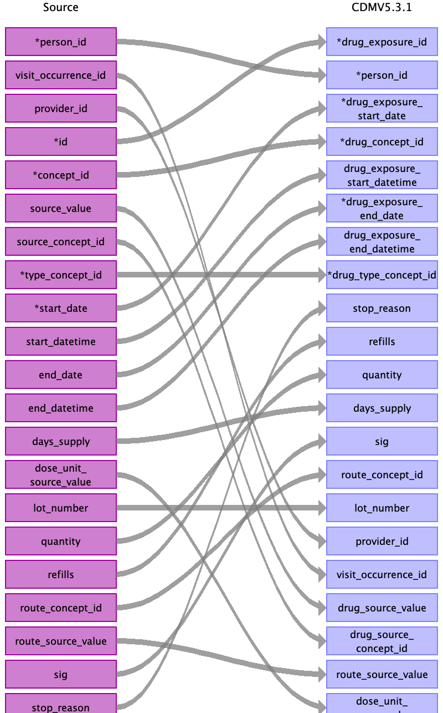

## Table name: drug_exposure

### Reading from gp_prescriptions

Drug code either in read_2, bnf_code or dmd_code. Mutually exclusive.

Field to field mapping to be completed.

| Destination Field | Source field | Logic | Comment field |
| --- | --- | --- | --- |
| drug_exposure_id |  |  |  |
| person_id | eid |  |  |
| drug_concept_id | dmd_code read_2 drug_name | Coding priority: use dm+d, then read, then drug name. The BNF code is not complete and not specific enough. |  |
| drug_exposure_start_date | issue_date |  |  |
| drug_exposure_start_datetime |  |  |  |
| drug_exposure_end_date | issue_date quantity | No drug end date available, estimate using Themis convention:  either same as start date (if no valid quantity available), or 1 day x quantity (valid if expressed as: tablets, capsules, doses, strips, sachets, units, or a whole number without unit; other units such as volume will be ignored). |  |
| drug_exposure_end_datetime |  |  |  |
| verbatim_end_date |  |  |  |
| drug_type_concept_id |  |  | 38000177 - Prescription written |
| stop_reason |  |  |  |
| refills |  |  |  |
| quantity | quantity | Quantity is free text field, but 60% can be parsed using a simple regex. |  |
| days_supply |  |  |  |
| sig |  |  |  |
| route_concept_id |  |  |  |
| lot_number |  |  |  |
| provider_id |  |  |  |
| visit_occurrence_id |  |  |  |
| visit_detail_id |  |  |  |
| drug_source_value | dmd_code read_2 drug_name |  |  |
| drug_source_concept_id | dmd_code read_2 drug_name |  |  |
| route_source_value |  |  |  |
| dose_unit_source_value |  |  |  |
| data_source | data_provider | Map as "GP-" + number found in data_provider, e.g. GP-1, GP-2, GP-3, or GP-4 |  |

### Reading from stem_table

| Destination Field | Source field | Logic | Comment field |
| --- | --- | --- | --- |
| drug_exposure_id | id |  |  |
| person_id | person_id |  |  |
| drug_concept_id | concept_id |  |  |
| drug_exposure_start_date | start_date |  |  |
| drug_exposure_start_datetime | start_datetime |  |  |
| drug_exposure_end_date | end_date |  |  |
| drug_exposure_end_datetime | end_datetime |  |  |
| verbatim_end_date |  |  |  |
| drug_type_concept_id | type_concept_id |  | 38000177 - Prescription written |
| stop_reason | stop_reason |  |  |
| refills | refills |  |  |
| quantity | quantity |  |  |
| days_supply | days_supply |  |  |
| sig | sig |  |  |
| route_concept_id | route_concept_id |  |  |
| lot_number | lot_number |  |  |
| provider_id | provider_id |  |  |
| visit_occurrence_id | visit_occurrence_id |  |  |
| visit_detail_id |  |  |  |
| drug_source_value | source_value |  |  |
| drug_source_concept_id | source_concept_id |  |  |
| route_source_value | route_source_value |  |  |
| dose_unit_source_value | dose_unit_source_value |  |  |

