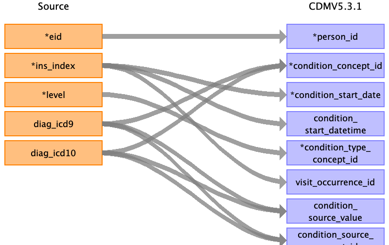

---
layout: default
title: Hesin Diag To Condition Occurrence
nav_order: 12
---

## Table name: condition_occurrence

### Reading from hesin_diag

Join hesin using ins_index

| Destination Field | Source field | Logic | Comment field |
| --- | --- | --- | --- |
| condition_occurrence_id |  |  | Auto-increment |
| person_id | eid |  |  |
| condition_concept_id | diag_icd10 diag_icd9 | If diag_icd10 is filled, map ICD10 to Standard OMOP concept.   If diag_icd10 is empty and diag_icd9 is filled, map ICD9 to Standard Concept.   |  |
| condition_start_date | admidate | Join hesin on eid and ins_index to get admidate. | hesin.admidate  |
| condition_start_datetime | admidate | Join hesin on eid and ins_index to get admidate. | hesin.admidate  |
| condition_end_date |  |  |  |
| condition_end_datetime |  |  |  |
| condition_type_concept_id | | 32817 - 'EHR' | |
| stop_reason |  |  |  |
| provider_id |  |  |  |
| visit_occurrence_id | ins_index | Lookup visit_occurrence_id by spell_index |  |
| visit_detail_id |  | Lookup by eid and ins_index |  |
| condition_source_value | diag_icd9 diag_icd10 |  |  |
| condition_source_concept_id | diag_icd9 diag_icd10 |  |  |
| condition_status_concept_id |level | 1 - 32902 primary diagnosis, 2 or 3 - 32908 secondary diagnosis|  |
| condition_status_source_value | level |  |  |
| data_source |  | 'HES-<dsource>' |  |