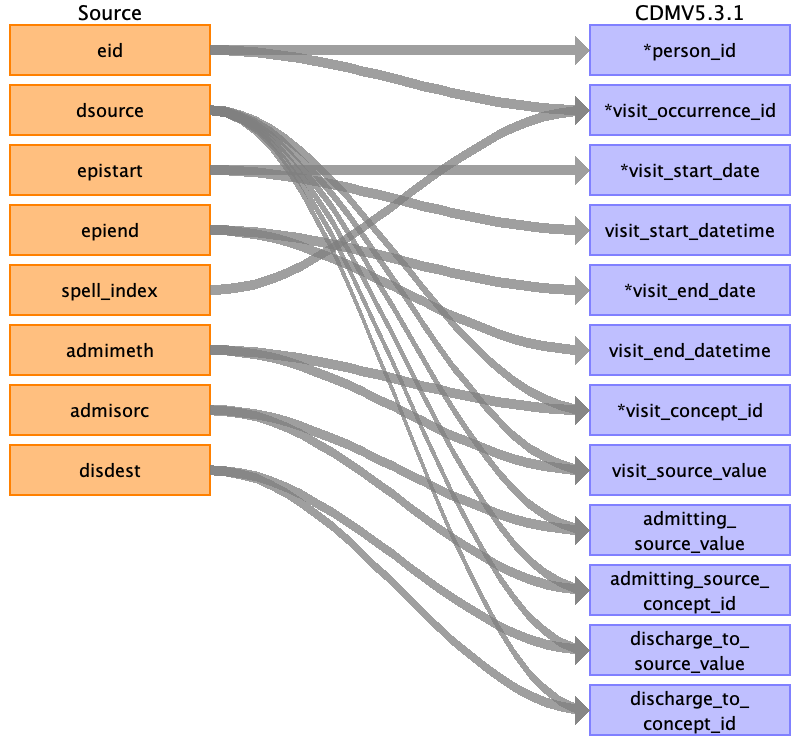

---
layout: default
title: Hesin To Visit Detail
nav_order: 10
---

## Table name: visit_detail

### Reading from hesin_c.txt

Create a new field 'record_source_value' for lookup of visit_detail_id by eid and ins_index.

Every record of hesin (episode) is a visit_detail record

| Destination Field | Source field | Logic | Comment field |
| --- | --- | --- | --- |
| visit_detail_id | eid ins_index | Concatenate eid and ins_index | |
| person_id | eid |  |  |
| visit_occurrence_id | eid spell_index | Lookup vist_occurrence_id by eid and spellindex  eid=visit_occurrence.person_id  'HES-spell_index'=visit_occurrence.record_source_value  |  |
| visit_start_date | epistart |  |  |
| visit_start_datetime | epistart |  |  |
| visit_end_date | epiend |  |  |
| visit_end_datetime | epiend |  |  |
| visit_concept_id | admimeth dsource | Map same as for visit_occurrence |  |
| visit_source_value | dsource admimeth |  |  |
| visit_type_concept_id |  |  | 32827,  # 'EHR encounter record' |
| provider_id |  |  | This can be retrieved from either hesin.mainspef or hesin.tretspef. Not implemented. |
| care_site_id |  |  |  |
| visit_source_concept_id |  |  |  |
| admitting_source_value | admisorc dsource |  |  |
| admitting_source_concept_id | admisorc dsource |  |  |
| discharge_to_source_value | disdest dsource |  |  |
| discharge_to_concept_id | disdest dsource |  |  |
| preceding_visit_detail_id |  |  |  |
| visit_detail_parent_id |  |  |  |
| record_source_value | ins_index | HES + ins_index | The ins_index with eid is the unique key for hesin table. |

