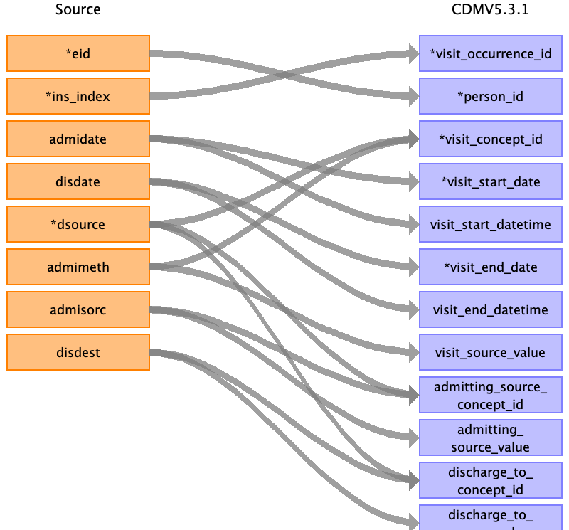

## Table name: visit_occurrence

### Reading from hesin

Group by the eid and spell_index. Where a spell is  “spell” is a total continuous stay of a patient in a single hospital from admission to discharge. 

From admission to discharge

| Destination Field | Source field | Logic | Comment field |
| --- | --- | --- | --- |
| visit_occurrence_id | eid spell_index | concatenate '3', eid, spell_index | |
| person_id | eid |  |  |
| visit_concept_id | dsource admimeth | Map combination of dsource(record origin) and Grouping to higher level - planned = inpatient visit (9201) - unplanned = emergency room visit (9203)   Mapping to standard concept in: /resources/mapping_tables/hesin_admimeth.csv |  |
| visit_start_date | admidate | Minimum | Patients can have different episodes within the same spell, resulting to more than one admidate records for the same eid+spell_index (see: https://biobank.ndph.ox.ac.uk/showcase/showcase/docs/HospitalEpisodeStatistics.pdf). For the beginning of the spell keep the earliest date.|
| visit_start_datetime | admidate |  |  |
| visit_end_date | disdate | Maximum | Similar to admidate. For the end of the spell keep the latest date. |
| visit_end_datetime | disdate |  |  |
| visit_type_concept_id |  |  | 32827,  # 'EHR encounter record' |
| provider_id |  |  |  |
| care_site_id |  |  |  |
| visit_source_value | dsource admimeth | 'record origin:<dsource>/admission method:<admimeth>' |  |
| visit_source_concept_id |  |  |  |
| admitting_source_concept_id | admisorc dsource | Lookup depends on dsource.  Group by high level mapping:   - Home (19, 10)   - Hospital   Mapping to standard concept in: /resources/mapping_tables/hesin_admisorc.csv|  |
| admitting_source_value | dsource admisorc | 'record origin:<dsource>/admission method:<admisorc>' |  |
| discharge_to_concept_id | dsource disdest | Lookup depends on dsource.  Group by high level mapping:   - Home (19, 10)   - Hospital   Mapping to standard concept in: /resources/mapping_tables/hesin_disdest.csv |  |
| discharge_to_source_value | dsource disdest | 'record origin:<dsource>/admission method:<disdest>' |  |
| preceding_visit_occurrence_id |  |  |  |
| recoed_source_value |  | 'HES-<spel_index> |  |
| data_source |  | HES-<data_source>|  |