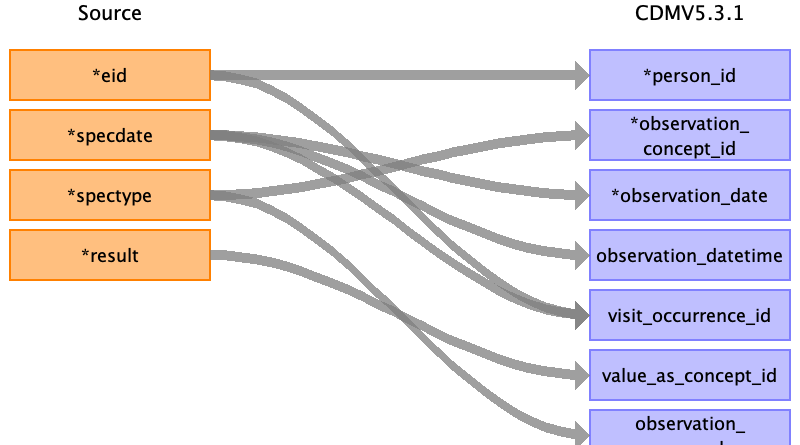
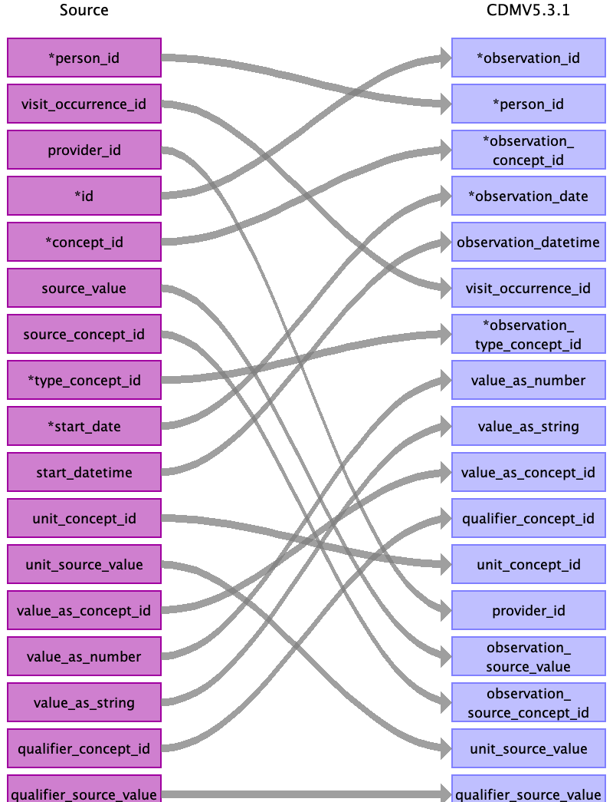

## Table name: observation

### Reading from covid

Type of test done (type of specimen collected) with result (positive or negative or suspected).
Covid is mapped as post coordinated concept.

| Destination Field | Source field | Logic | Comment field |
| --- | --- | --- | --- |
| observation_id |  |  |  |
| person_id | eid |  |  |
| observation_concept_id | spectype | Data-coding: 1853 (https://biobank.ctsu.ox.ac.uk/crystal/coding.cgi?id=1853). Mapping to standard concept in: /resources/source_to_concept/covid_spectype.csv |  |
| observation_date | specdate |  |  |
| observation_datetime | specdate |  |  |
| visit_occurrence_id | specdate eid | Lookup in previously created visit occurrence by eid and specdate |  |
| observation_type_concept_id |  |  | 38000279 - Lab observation concept code result |
| value_as_number |  |  |  |
| value_as_string |  |  |  |
| value_as_concept_id | result | the test result: 1 (Positive)-> 45884084, 0 (Negative)-> 45878583 |  |
| qualifier_concept_id |  |  |  |
| unit_concept_id |  |  |  |
| provider_id |  |  |  |
| visit_detail_id |  |  |  |
| observation_source_value | spectype |  |  |
| observation_source_concept_id |  |  |  |
| unit_source_value |  |  |  |
| qualifier_source_value |  |  |  |

### Reading from stem_table

| Destination Field | Source field | Logic | Comment field |
| --- | --- | --- | --- |
| observation_id | id |  |  |
| person_id | person_id |  |  |
| observation_concept_id | concept_id |  |  |
| observation_date | start_date |  |  |
| observation_datetime | start_datetime |  |  |
| visit_occurrence_id | visit_occurrence_id |  |  |
| observation_type_concept_id | type_concept_id |  | 38000279 - Lab observation concept code result |
| value_as_number | value_as_number |  |  |
| value_as_string | value_as_string |  |  |
| value_as_concept_id | value_as_concept_id |  |  |
| qualifier_concept_id | qualifier_concept_id |  |  |
| unit_concept_id | unit_concept_id |  |  |
| provider_id | provider_id |  |  |
| visit_detail_id |  |  |  |
| observation_source_value | source_value |  |  |
| observation_source_concept_id | source_concept_id |  |  |
| unit_source_value | unit_source_value |  |  |
| qualifier_source_value | qualifier_source_value |  |  |

### Reading from gp_clinical

When event_dt is empty, capture 'history of'

| Destination Field | Source field | Logic | Comment field |
| --- | --- | --- | --- |
| observation_id |  |  |  |
| person_id |  |  |  |
| observation_concept_id |  |  |  |
| observation_date |  |  |  |
| observation_datetime |  |  |  |
| visit_occurrence_id |  |  |  |
| observation_type_concept_id |  |  | 38000279 - Lab observation concept code result |
| value_as_number |  |  |  |
| value_as_string |  |  |  |
| value_as_concept_id |  |  |  |
| qualifier_concept_id |  |  |  |
| unit_concept_id |  |  |  |
| provider_id |  |  |  |
| visit_detail_id |  |  |  |
| observation_source_value |  |  |  |
| observation_source_concept_id |  |  |  |
| unit_source_value |  |  |  |
| qualifier_source_value |  |  |  |

