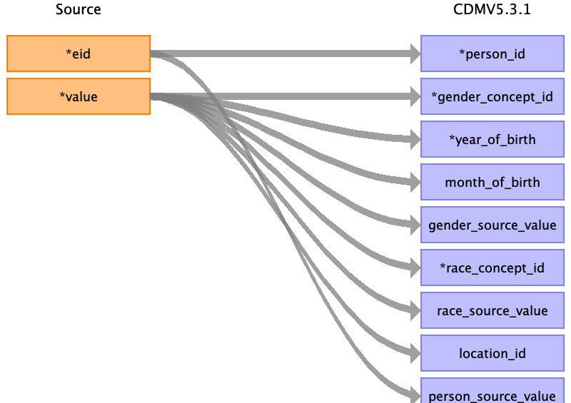

## Table name: person

### Reading from baseline

| Destination Field | Source field | Logic | Comment field |
| --- | --- | --- | --- |
| person_id | eid |  |  |
| gender_concept_id | value | Value from field 31-0.0  Female - 8532  Male - 8507 |  |
| year_of_birth | value | Value from field 34-0.0 |  |
| month_of_birth | value | Value from field 52-0.0 |  |
| gender_source_value | value | Value from field 31 |  |
| day_of_birth |  |  |  |
| birth_datetime |  |  |  |
| race_concept_id | value | Value from field 21000  Only top level (White, mixed, asian, black, chinese) | Is present in UKB data, but >90% 'white british'. |
| race_source_value | value | Value from field 21000 |  |
| ethnicity_concept_id |  |  | NULL |
| location_id | value | Value from field 54  Populate location table with each of the ~23 cities where assessment center where. | Centers in 23 different cities  (either location or care_site)  |
| care_site_id |  |  |  |
| provider_id |  |  |  |
| person_source_value | eid |  |  |
| gender_source_concept_id |  |  |  |
| race_source_concept_id |  |  |  |
| ethnicity_source_value |  |  |  |
| ethnicity_source_concept_id |  |  |  |

