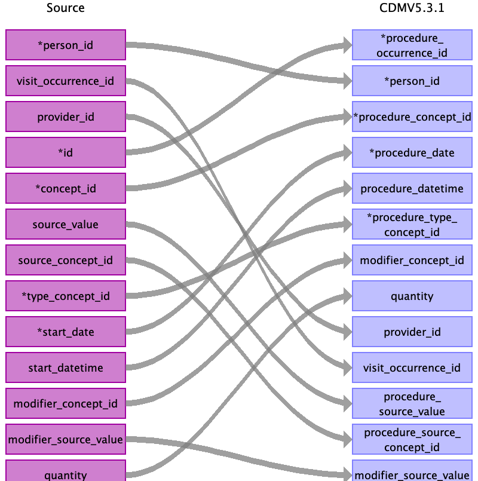

## Table name: procedure_occurrence

### Reading from hesin_oper

| Destination Field | Source field | Logic | Comment field |
| --- | --- | --- | --- |
| procedure_occurrence_id |  |  | Auto-increment |
| person_id | eid |  |  |
| procedure_concept_id | oper4 oper3 | Map to standard OMOP concept Map to standard OMOP concept |  |
| procedure_date | opdate |  |  |
| procedure_datetime | opdate |  |  |
| procedure_type_concept_id | level | 1 - 44786630 Primary Procedure  2 - 44786631 Secondary Procedure |  |
| modifier_concept_id |  |  |  |
| quantity |  |  |  |
| provider_id |  |  |  |
| visit_occurrence_id | ins_index eid | Lookup visit_occurrence_id by ins_index and eid  |  |
| visit_detail_id |  |  |  |
| procedure_source_value | oper3 oper4 |  |  |
| procedure_source_concept_id | oper3 oper4 |  |  |
| modifier_source_value |  |  |  |

### Reading from stem_table

| Destination Field | Source field | Logic | Comment field |
| --- | --- | --- | --- |
| procedure_occurrence_id | id |  | Auto-increment |
| person_id | person_id |  |  |
| procedure_concept_id | concept_id |  |  |
| procedure_date | start_date |  |  |
| procedure_datetime | start_datetime |  |  |
| procedure_type_concept_id | type_concept_id |  |  |
| modifier_concept_id | modifier_concept_id |  |  |
| quantity | quantity |  |  |
| provider_id | provider_id |  |  |
| visit_occurrence_id | visit_occurrence_id |  |  |
| visit_detail_id |  |  |  |
| procedure_source_value | source_value |  |  |
| procedure_source_concept_id | source_concept_id |  |  |
| modifier_source_value | modifier_source_value |  |  |

