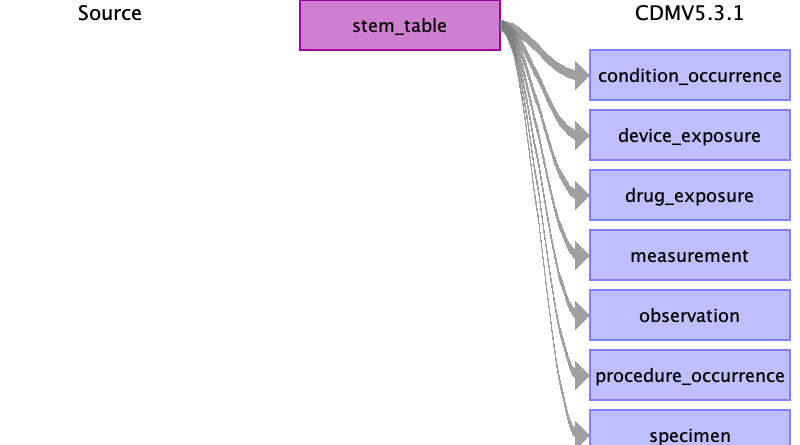

# Stem table to OMOP clinical event tables

The stem table is mapped to the respective OMOP domains based on the domain_id.
The following rules are applied, in this order:

1. If `stem_table.domain_id` given, then read target domain from `stem_table.domain_id`
2. If `stem_table.concept_id` not 0, then read target domain from `concept.domain_id`
3. Else, the target domain is Observation.

## Contents

[condition_occurrence](condition_occurrence.md)

[device_exposure](device_exposure.md)

[drug_exposure](drug_exposure.md)

[measurement](measurement.md)

[observation](observation.md)

[procedure_occurrence](procedure_occurrence.md)

[specimen](specimen.md)

[source_appendix](source_appendix.md)

