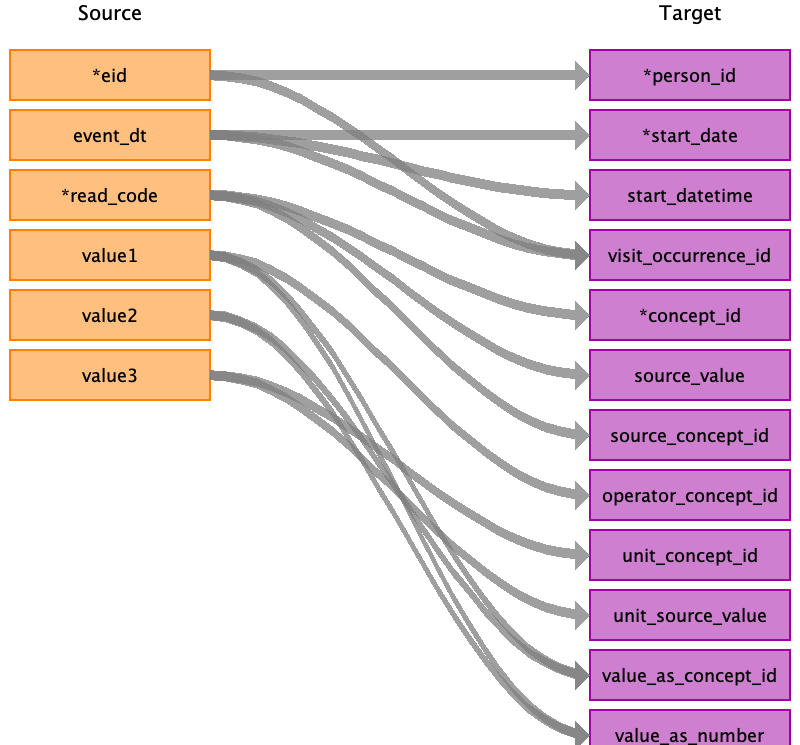

## Table name: stem_table

### Reading from gp_clinical

The _gp_clinical_ table contains clinical records from primary care linked data of consented UKB participants.
The variables include date and clinical code (Read v2 or CTV3 1) for primary care events, 
such as consultations, diagnoses, history, symptoms, procedures, laboratory tests and administrative information.
The records are retrieved from four different source systems (providers): EMIS/Vision Scotland, EMIS/Vision Wales, 
TPP England and Vision England (Note: EMIS England is missing).
Coded data has been obtained for just 45% of the UKB participants.

#### Notes on variables:
- `read_2` and `read_3`: clinical codes, either Read v2 or CTV3 (i.e. Read v3). 
Mappings to standard OMOP concept_ids are only available for Read v2 codes in Athena,
but CTV3 codes that overlap with Read v2 could be also be mapped.
A READv2-CTV3-SNOMED mapping is available from the NHS: https://isd.digital.nhs.uk/trud3/user/guest/group/0/pack/9/subpack/9/releases
- `value1`, `value2`, `value3` fields: each provider stores the data in its own format, 
and each Read clinical code requires its own set of values. 
Therefore, the meaning of `value1`, `value2` and `value3` differ per `data_provider` and per `read_2` / `read_3` code. 
Provider-specific mapping logic needs to be implemented, 
for some of the values this is available at [https://github.com/spiros/ukb-biomarker-phenotypes](
https://github.com/spiros/ukb-biomarker-phenotypes#implementation-25).
Suppliers’ extracts contain only numeric data in one (TPP) or two (England (Vision), Wales) `value` fields.
- `event_dt` (date) field: to protect individuals, alterations have been made to dates in relation to the participant's
 date of birth as follows: 01/01/1901 (before birth), 02/02/1902 (on birth), 03/03/1903 (after birth), 07/07/2037 (future). 
 
 
**TBD:**
 - decide on date handling (`event_dt`), skip empty or not? use which dates?
 - map value fields based on provider/Read code-specific logic (only selected phenotypes, 
 start with examples from [https://github.com/spiros/ukb-biomarker-phenotypes](https://github.com/spiros/ukb-biomarker-phenotypes#implementation-25).
 Ideally capture logic in a mapping table and automatically apply during ETL execution.

| Destination Field | Source field | Logic | Comment field |
| --- | --- | --- | --- |
| id |  |  |  |
| domain_id |  |  |  |
| person_id | eid |  |  |
| start_date | event_dt | If date empty, ignore record. Capture as observation (history of) |  |
| start_datetime | event_dt |  |  |
| visit_occurrence_id | eid event_dt | Look up visit occurrence by unique eid+event_dt  |  |
| provider_id |  |  |  |
| concept_id | read_code | Map to OMOP standard concept |  |
| source_value | read_code |  |  |
| source_concept_id | read_code | As Read concept |  |
| type_concept_id |  |  | For condition: 32020 - EHR encounter diagnosis / For meas/obs: derived from EHR |
| end_date |  |  |  |
| end_datetime |  |  |  |
| verbatim_end_date |  |  |  |
| days_supply |  |  |  |
| dose_unit_source_value |  |  |  |
| lot_number |  |  |  |
| modifier_concept_id |  |  |  |
| modifier_source_value |  |  |  |
| operator_concept_id | value1 | IF prefixed with OPR |  |
| modifier_source_value |  |  |  |
| quantity |  |  |  |
| range_high |  |  |  |
| range_low |  |  |  |
| refills |  |  |  |
| route_concept_id |  |  |  |
| route_source_value |  |  |  |
| sig |  |  |  |
| stop_reason |  |  |  |
| unique_device_id |  |  |  |
| unit_concept_id | value3 | Map to UCUM (standard OMOP unit concept) |  |
| unit_source_value | value3 |  |  |
| value_as_concept_id | value1 value2 | Meaning of value depends on the read_code and data_provider.  | Same for value 1, 2, 3   |
| value_as_number | value1 value2 |  |  |
| value_as_string |  |  |  |
| value_source_value |  |  |  |
| anatomic_site_concept_id |  |  |  |
| disease_status_concept_id |  |  |  |
| specimen_source_id |  |  |  |
| anatomic_site_source_value |  |  |  |
| disease_status_source_value |  |  |  |
| condition_status_concept_id |  |  |  |
| condition_status_source_value |  |  |  |
| qualifier_concept_id |  |  |  |
| qualifier_source_value |  |  |  | 
| data_source | data_provider | Map as "GP-" + number found in data_provider, e.g. GP-1, GP-2, GP-3, or GP-4 |  |

### Reading from baseline

| Destination Field | Source field | Logic | Comment field |
| --- | --- | --- | --- |
| id |  |  |  |
| domain_id |  |  |  |
| person_id |  |  |  |
| start_date |  |  |  |
| start_datetime |  |  |  |
| visit_occurrence_id |  |  |  |
| provider_id |  |  |  |
| concept_id |  |  |  |
| source_value |  |  |  |
| source_concept_id |  |  |  |
| type_concept_id |  |  | For condition: 32020 - EHR encounter diagnosis  For meas/obs: derived from EHR |
| end_date |  |  |  |
| end_datetime |  |  |  |
| verbatim_end_date |  |  |  |
| days_supply |  |  |  |
| dose_unit_source_value |  |  |  |
| lot_number |  |  |  |
| modifier_concept_id |  |  |  |
| modifier_source_value |  |  |  |
| operator_concept_id |  |  |  |
| modifier_source_value |  |  |  |
| quantity |  |  |  |
| range_high |  |  |  |
| range_low |  |  |  |
| refills |  |  |  |
| route_concept_id |  |  |  |
| route_source_value |  |  |  |
| sig |  |  |  |
| stop_reason |  |  |  |
| unique_device_id |  |  |  |
| unit_concept_id |  |  |  |
| unit_source_value |  |  |  |
| value_as_concept_id |  |  |  |
| value_as_number |  |  |  |
| value_as_string |  |  |  |
| value_source_value |  |  |  |
| anatomic_site_concept_id |  |  |  |
| disease_status_concept_id |  |  |  |
| specimen_source_id |  |  |  |
| anatomic_site_source_value |  |  |  |
| disease_status_source_value |  |  |  |
| condition_status_concept_id |  |  |  |
| condition_status_source_value |  |  |  |
| qualifier_concept_id |  |  |  |
| qualifier_source_value |  |  |  |

