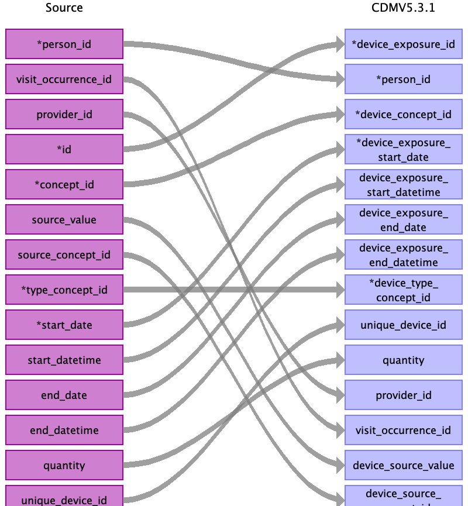

## Table name: device_exposure

### Reading from stem_table

| Destination Field | Source field | Logic | Comment field |
| --- | --- | --- | --- |
| device_exposure_id | id |  |  |
| person_id | person_id |  |  |
| device_concept_id | concept_id |  0 if `concept_id` is empty |  |
| device_exposure_start_date | start_date |  |  |
| device_exposure_start_datetime | start_datetime |  |  |
| device_exposure_end_date | end_date |  |  |
| device_exposure_end_datetime | end_datetime |  |  |
| device_type_concept_id | type_concept_id |  |  |
| unique_device_id | unique_device_id value_as_string | Use unique_device_id if given, otherwise use value_as_string. | The value from the baseline table is always written to value_as_string, which contains the actual device id in case the field maps to the use of a device. |
| quantity | quantity |  |  |
| provider_id | provider_id |  |  |
| visit_occurrence_id | visit_occurrence_id |  |  |
| visit_detail_id |  |  |  |
| device_source_value | source_value |  |  |
| device_source_concept_id | source_concept_id |  |  |

