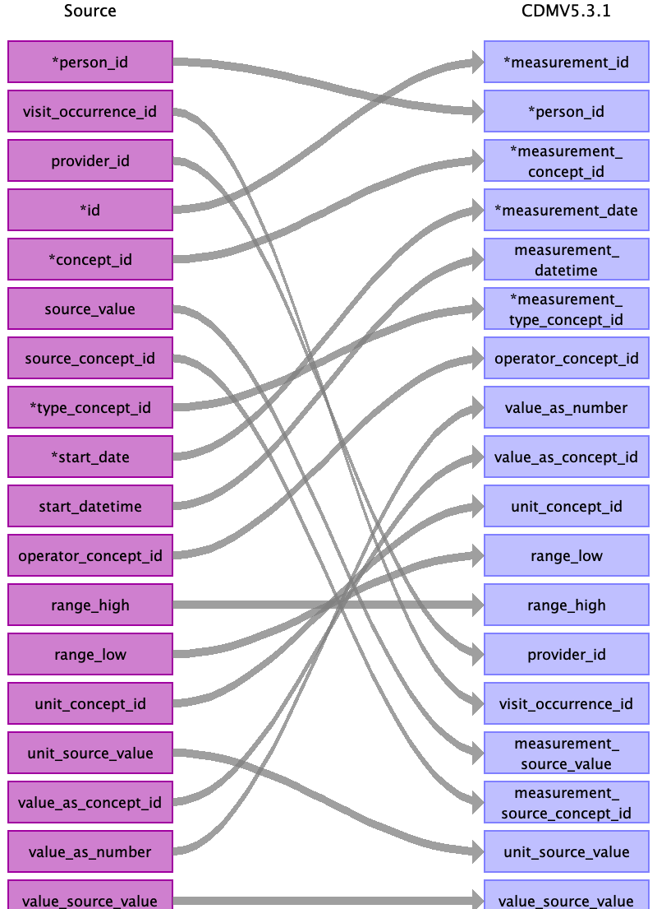

## Table name: measurement

### Reading from stem_table

| Destination Field | Source field | Logic | Comment field |
| --- | --- | --- | --- |
| measurement_id | id |  |  |
| person_id | person_id |  |  |
| measurement_concept_id | concept_id |  0 if `concept_id` is empty |  |
| measurement_date | start_date |  |  |
| measurement_datetime | start_datetime |  |  |
| measurement_time |  |  |  |
| measurement_type_concept_id | type_concept_id |  |  |
| operator_concept_id | operator_concept_id |  |  |
| value_as_number | value_as_number |  |  |
| value_as_concept_id | value_as_concept_id |  |  |
| unit_concept_id | unit_concept_id |  |  |
| range_low | range_low |  |  |
| range_high | range_high |  |  |
| provider_id | provider_id |  |  |
| visit_occurrence_id | visit_occurrence_id |  |  |
| visit_detail_id |  |  |  |
| measurement_source_value | source_value |  |  |
| measurement_source_concept_id | source_concept_id |  |  |
| unit_source_value | unit_source_value |  |  |
| value_source_value | value_source_value |  |  |

