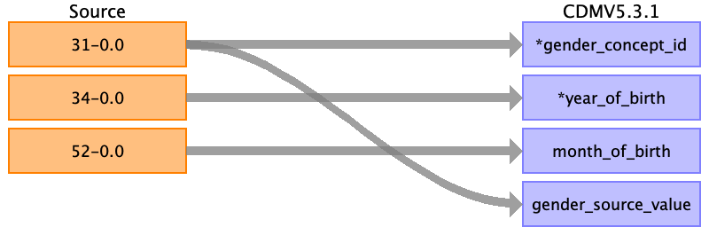

## Table name: visit_occurrence

### Reading from hesin

Group by the eid and spell_index. Where a spell is  “spell” is a total continuous stay of a patient in a single hospital from admission to discharge. 

From admission to discharge

| Destination Field | Source field | Logic | Comment field |
| --- | --- | --- | --- |
| visit_occurrence_id | spell_index | Capture eid+spell_index as unique lookup key for the visit | Auto-increment |
| person_id | eid |  |  |
| visit_concept_id | dsource admimeth | Map combination of dsource(record origin) and Grouping to higher level - planned = inpatient visit (9201) - unplanned = emergency room visit (9203) | The more granular information in admimeth can be stored in visit_detail. For gp_clinical, gp_prescription: 38004453 - Family Practice  For baseline: 44818519 - Clinical Study visit (to be discussed)  For covid: 32693 - Health examination |
| visit_start_date | admidate | Minimum | Patients can have different episodes within the same spell, resulting to more than one admidate records for the same eid+spell_index (see: https://biobank.ndph.ox.ac.uk/showcase/showcase/docs/HospitalEpisodeStatistics.pdf). For the beginning of the spell keep the earliest date.|
| visit_start_datetime | admidate |  |  |
| visit_end_date | disdate | Maximum | Similar to admidate. For the end of the spell keep the latest date. |
| visit_end_datetime | disdate |  |  |
| visit_type_concept_id |  |  | For gp_clinical, gp_prescriptions: 44818518 - Visit derived from EHR record.  For hesin: 44818517 - Visit derived from encounter on claim.  For baseline: 44818519 - Clinical Study visit.  For covid: 44818518 - Visit derived from EHR record |
| provider_id |  |  |  |
| care_site_id |  |  | For hesin: care site group info is present, but not granular enough. |
| visit_source_value | dsource admimeth | keep both the record origin and the method with some text on which is which |  |
| visit_source_concept_id |  |  |  |
| admitting_source_concept_id | admisorc dsource | Lookup depends on dsource.  Group by high level mapping:   - Home (19, 10)   - Hospital  |  |
| admitting_source_value | dsource admisorc | same as visit source value |  |
| discharge_to_concept_id | dsource disdest | Lookup depends on dsource.  Group by high level mapping:   - Home (19, 10)   - Hospital    98 = not applicable |  |
| discharge_to_source_value | dsource disdest | same as visit source value |  |
| preceding_visit_occurrence_id |  |  |  |

### Reading from gp_prescriptions

See gp_clinical, merge the two

| Destination Field | Source field | Logic | Comment field |
| --- | --- | --- | --- |
| visit_occurrence_id |  |  | Auto-increment |
| person_id | eid |  |  |
| visit_concept_id |  |  | For gp_clinical, gp_prescription: 38004453 - Family Practice  For baseline: 44818519 - Clinical Study visit (to be discussed)  For covid: 32693 - Health examination |
| visit_start_date | issue_date |  |  |
| visit_start_datetime | issue_date |  |  |
| visit_end_date | issue_date |  |  |
| visit_end_datetime | issue_date |  |  |
| visit_type_concept_id |  |  | For gp_clinical, gp_prescriptions: 44818518 - Visit derived from EHR record.  For hesin: 44818517 - Visit derived from encounter on claim.  For baseline: 44818519 - Clinical Study visit.  For covid: For covid: 44818518 - Visit derived from EHR recordFor covid: 44818518 - Visit derived from EHR record |
| provider_id |  |  |  |
| care_site_id |  |  | For hesin: care site group info is present, but not granular enough. |
| visit_source_value |  |  |  |
| visit_source_concept_id |  |  |  |
| admitting_source_concept_id |  |  |  |
| admitting_source_value |  |  |  |
| discharge_to_concept_id |  |  |  |
| discharge_to_source_value |  |  |  |
| preceding_visit_occurrence_id |  |  |  |

### Reading from gp_clinical

Merge with gp_prescriptions to get all unique eid+event_dt/issue_date combinations.

| Destination Field | Source field | Logic | Comment field |
| --- | --- | --- | --- |
| visit_occurrence_id |  |  | Auto-increment |
| person_id | eid |  |  |
| visit_concept_id |  |  | For gp_clinical, gp_prescription: 38004453 - Family Practice  For baseline: 44818519 - Clinical Study visit (to be discussed)  For covid: 32693 - Health examination |
| visit_start_date | event_dt |  |  |
| visit_start_datetime | event_dt |  |  |
| visit_end_date | event_dt |  |  |
| visit_end_datetime | event_dt |  |  |
| visit_type_concept_id |  |  | For gp_clinical, gp_prescriptions: 44818518 - Visit derived from EHR record.  For hesin: 44818517 - Visit derived from encounter on claim.  For baseline: 44818519 - Clinical Study visit.  For covid: 44818518 - Visit derived from EHR record |
| provider_id |  |  |  |
| care_site_id | data_provider | Capture in the care_site table  1 - England, Vision  2 - Scotland  3 - England, TPP  4 - Wales | Placeholder.  Note, the data_provider is not the specific care site, but what system the data what extracted from. For hesin: care site group info is present, but not granular enough. |
| visit_source_value |  |  |  |
| visit_source_concept_id |  |  |  |
| admitting_source_concept_id |  |  |  |
| admitting_source_value |  |  |  |
| discharge_to_concept_id |  |  |  |
| discharge_to_source_value |  |  |  |
| preceding_visit_occurrence_id |  |  |  |

### Reading from baseline

One person can have up to 4 visits (labeled 0-3).
Follow-up online or to assessment center.

| Destination Field | Source field | Logic | Comment field |
| --- | --- | --- | --- |
| visit_occurrence_id |  |  | Auto-increment |
| person_id | eid |  |  |
| visit_concept_id |  |  | For gp_clinical, gp_prescription: 38004453 - Family Practice  For baseline: 44818519 - Clinical Study visit (to be discussed)  For covid: 32693 - Health examination |
| visit_start_date | value | Field 53-0.0 -> date of initial assessment visit  Field 53-1.0 -> date of repeat assessment visit  Field 53-2.0 -> date of first imaging visit  Field 53-3.0 -> date of second imaging visit | For each  |
| visit_start_datetime | value | Same as mapping to visit_start_date |  |
| visit_end_date | value | Same as mapping to visit_start_date |  |
| visit_end_datetime | value | Same as mapping to visit_start_date |  |
| visit_type_concept_id |  | 32883 - Survey |  |
| provider_id |  |  |  |
| care_site_id | value | Corresponding value from field 54.x.0 | See also person to location_id mapping For hesin: care site group info is present, but not granular enough. |
| visit_source_value |  |  |  |
| visit_source_concept_id |  |  |  |
| admitting_source_concept_id |  |  |  |
| admitting_source_value |  |  |  |
| discharge_to_concept_id |  |  |  |
| discharge_to_source_value |  |  |  |
| preceding_visit_occurrence_id |  |  |  |

### Reading from covid

| Destination Field | Source field | Logic | Comment field |
| --- | --- | --- | --- |
| visit_occurrence_id |  |  | Auto-increment |
| person_id | eid |  |  |
| visit_concept_id |  |  | For gp_clinical, gp_prescription: 38004453 - Family Practice  For baseline: 44818519 - Clinical Study visit (to be discussed)  For covid: 32693 - Health examination |
| visit_start_date | specdate |  |  |
| visit_start_datetime | specdate |  |  |
| visit_end_date | specdate |  |  |
| visit_end_datetime | specdate |  |  |
| visit_type_concept_id |  |  | For gp_clinical, gp_prescriptions: 44818518 - Visit derived from EHR record.  For hesin: 44818517 - Visit derived from encounter on claim.  For baseline: 44818519 - Clinical Study visit.  For covid: 44818518 - Visit derived from EHR record |
| provider_id |  |  |  |
| care_site_id | laboratory | Capture unique laboratories in care_site table. | For hesin: care site group info is present, but not granular enough. |
| visit_source_value |  |  |  |
| visit_source_concept_id |  |  |  |
| admitting_source_concept_id |  |  |  |
| admitting_source_value |  |  |  |
| discharge_to_concept_id |  |  |  |
| discharge_to_source_value |  |  |  |
| preceding_visit_occurrence_id |  |  |  |

